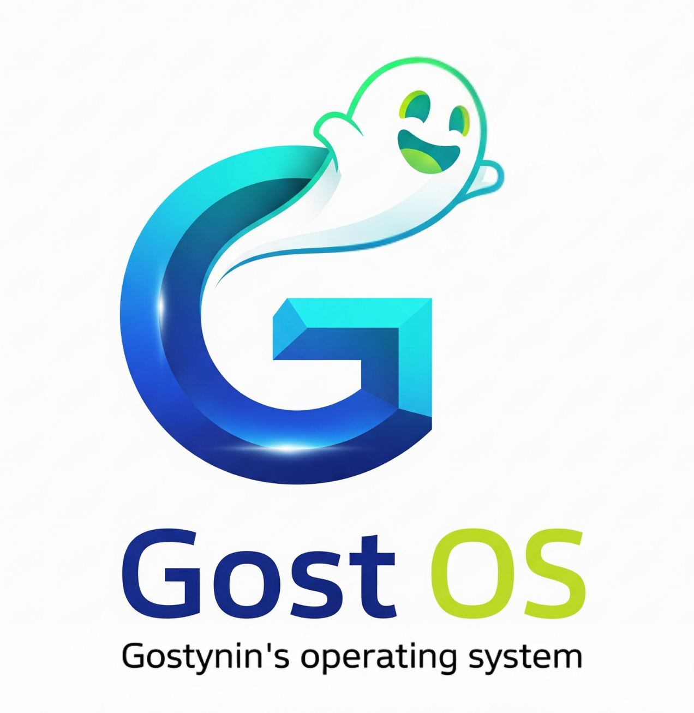

  

<h1 align="center">GOST OS</h1>

  <em>Gostynin's Operating System</em>

  
  
  

> System operacyjny, który łączy legendarną stabilność i szybkość Linuksa z intuicyjnością inspirowaną najlepszymi rozwiązaniami Windows. Stworzony z szacunkiem dla zasobów Twojego komputera i Twojej prywatności.

---

### Dlaczego GOST OS?

Zbliżający się koniec wsparcia dla Windows 10 stawia miliony użytkowników przed dylematem: przesiadka na system, który nie zawsze spełnia ich oczekiwania, lub pozostanie z oprogramowaniem bez aktualizacji bezpieczeństwa. GOST OS narodził się z potrzeby stworzenia realnej alternatywy.

> Nie chcemy płacić za ociężały system, pełen błędów, luk i telemetrii. Wierzymy, że system operacyjny powinien być szybkim, niezawodnym i transparentnym narzędziem, a nie produktem, który traktuje użytkownika jak źródło danych. GOST OS to nasza odpowiedź na tę potrzebę.

---

## ✨ Filozofia Projektu

GOST OS opiera się na czterech filarach, które definiują każde nasze działanie:

* 🚀 **Wydajność:** System zaprojektowany do błyskawicznego działania, nawet na starszym sprzęcie. Minimalizm i świadoma rezygnacja z ociężałego oprogramowania to nasz priorytet.

* 💡 **Prostota:** Interfejs jest czysty, zrozumiały i przewidywalny. Ukrywamy skomplikowane technologie Linuksa pod płaszczem prostych, graficznych narzędzi.

* 🛡️ **Kontrola:** Użytkownik jest administratorem. System nie podejmuje decyzji za niego, nie zawiera telemetrii i pozwala na głęboką personalizację. Ty rządzisz swoim komputerem.

* ⚓ **Stabilność:** Fundament oparty na Debian Stable – jednej z najbardziej niezawodnych dystrybucji na świecie – gwarantuje przewidywalne i bezpieczne działanie na lata.

## 🛠️ Fundament Techniczny

* **Dystrybucja bazowa:** Debian Stable
* **Środowisko graficzne:** XFCE
* **Serwer wyświetlania:** Wayland
* **Jądro (Kernel):** LTS (Long-Term Support)
* **System pakietów:** APT & .deb

## 🗺️ Mapa Drogowa

Aktualnie znajdujemy się w pierwszej fazie rozwoju projektu.

-   [x] **Faza 0: Fundamenty** - Konfiguracja projektu, repozytorium i planowanie.
-   [x] **Faza 1 (Alfa):** Prototypowanie i konfiguracja wyglądu pulpitu.
-   [ ] **Faza 2 (Beta):** Integracja instalatora Calamares, Asystenta AI i Partycji Ratunkowej.
-   [ ] **Faza 3 (Stabilna 1.0 "Gostynin"):** Finalne testy, poprawki i publiczne udostępnienie.

---

**Projekt GOST OS jest na bardzo wczesnym etapie rozwoju. Zapraszamy do obserwowania postępów!**