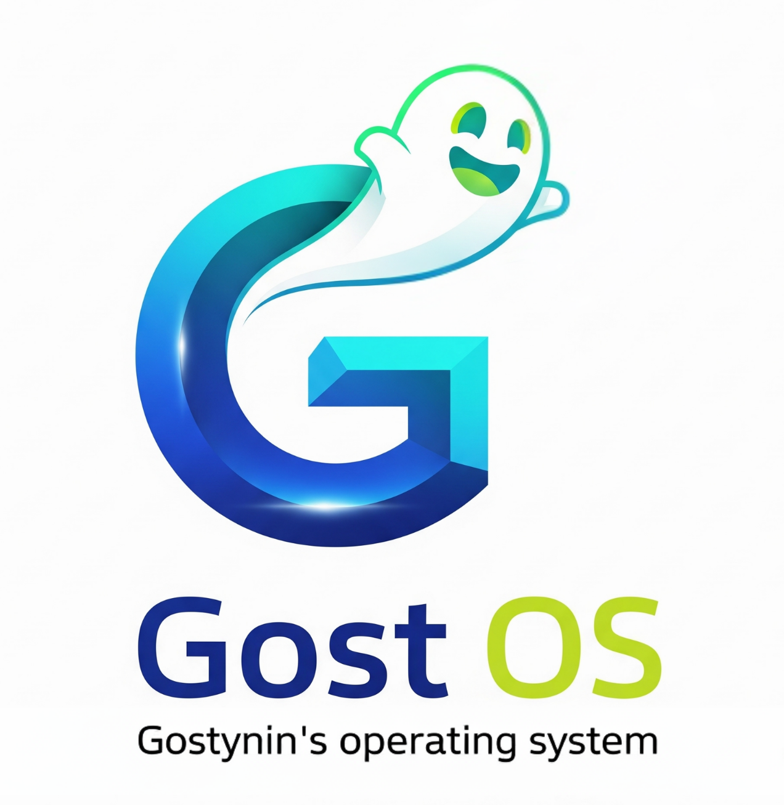

<p align="center">
  
</p>

<h1 align="center">GOST OS</h1>

<p align="center"><em>Gostynin's operating system</em></p>

<p align="center">
  
  
  
</p>

---

> **Uwaga:** projekt zaczął się od nowa. Wcześniejsza wersja GOST OS była dystrybucją Debiana
> budowaną przez `live-build` — XFCE z gotowym motywem, czyli konfiguracja cudzego środowiska.
> To repozytorium zawiera to, co zastąpiło tamto podejście: shell pisany od zera.

## Czym jest GostUI

**GostUI** to shell i środowisko graficzne pisane **od zera w Rust na Waylandzie** — nie fork
istniejącego DE i nie konfiguracja gotowego. Docelowo komponent graficzny GOST OS.

Założenie porządkujące cały interfejs: **ekran dzieli się na trzy nienachodzące się strefy**,
żeby użytkownik nigdy nie mylił UI systemu z UI aplikacji.

```
┌──────────────────────────────────────────────────────────────┐
│  [PROGRAMY]  🔍          14:32  ·  30.07.2026        [SYSTEM]│  ← system
├──────────────────────────────────────────────────────────────┤
│                                                              │
│   ┆                                                      ┆   │
│   ┆   [PLIKI]      [PRACA]      [ROZRYWKA]     [ + ]     ┆   │  ← slider kart
│   ┆                                                      ┆   │     (zamiast pulpitu)
│   ┆                                                      ┆   │
├──────────────────────────────────────────────────────────────┤
│  ▣ Terminal    ▣ Firefox    ▣ Menedżer plików                │  ← otwarte okna
└──────────────────────────────────────────────────────────────┘
```

- **Górny pasek** — wyłącznie system: Menu Start, wyszukiwanie, zegar, panel statusu.
- **Środek** — slider kart tematycznych zamiast pulpitu. Bez animacji, natychmiastowe przejścia,
  zero renderowania w spoczynku.
- **Dolny pasek** — wyłącznie przełącznik otwartych okien.

Menu Start to **dosłowna struktura folderów na dysku** (`~/gostui/menu_start/`) — zarządzasz nim
menedżerem plików, bez żadnego edytora menu.

W planie także własny menedżer plików, menedżer usług i panel sterowania — jako cienkie nakładki
nad gotowymi usługami systemowymi (systemd, NetworkManager, PipeWire, UPower), nie własne implementacje.

## Stan

**M0 zamknięty (2026-07-30), M1 w toku.** Działa i jest przetestowany model kart, model wyjść
(skala, obrót, odłączanie), silnik kafelkowania, konfiguracja z zapisem atomowym i parser
`.desktop` z kodami pól `Exec`. Od 2026-07-31 kompozytor otwiera **okno** w bieżącej sesji
(smithay 0.7, backend `winit`) i rysuje w nim shell dwiema równorzędnymi ścieżkami — GPU (GLES2)
i CPU. Od 2026-08-01 wygląd jest w całości konfigurowalny (`theme.toml`), a w górnym pasku
tyka zegar rysowany przez `cosmic-text`. Klientów jeszcze nie przyjmuje; gniazdo wayland to M2.

```bash
cargo test --workspace                  # 147 testów, bez ekranu i bez GPU
cargo run -p gostui-compositor          # layout policzony dla monitora i telefonu
cargo run -p gostui-compositor -- --png ui.png       # rysuje interfejs do plików PNG
cargo run -p gostui-compositor -- --backend winit    # okno w bieżącej sesji
cargo run -p gostui-compositor -- --backend winit --renderer pixman  # to samo, z CPU
```

`--png` daje dwa obrazy z **tego samego stanu**: `ui-monitor.png` (1920×1080)
i `ui-telefon.png` (720×1600, skala 2). Rysuje je rasteryzer software'owy — bez GPU
i bez kompozytora. Zegar jest prawdziwy; etykiety pozostałych elementów to nadal prostokąty
miejsca, które zajmą.

**Wygląd zmienia się w `~/.config/gostui/theme.toml`** — role kolorów, wysokości pasków,
rozmiary czcionek. Plik jest w całości opcjonalny: zmiana jednego koloru to trzy linijki,
a błędny wpis kosztuje ten jeden kolor, nie uruchomienie powłoki (D-032).

```toml
[palette]
accent = "#ff3860"
```

**Następny krok: M1 krok 6** — licznik klatek `GOSTUI_STATS=1`. Kroki rozpisane
w [`docs/01-strategia-dev-test.md`](docs/01-strategia-dev-test.md) §4.

Budowanie w kontenerze, bez zależności od dystrybucji:

```bash
docker build -t gostui-build .
docker run --rm -v "$PWD:/src" gostui-build cargo test --workspace
```

Kontener **kompiluje**, nie uruchamia — kompozytor potrzebuje DRM/KMS, seatu i urządzeń
wejściowych, a oddanie ich kontenerowi sprawia, że test przestaje cokolwiek weryfikować.

## Dokumentacja

| Dokument | Zawartość |
|---|---|
| [`gostos.md`](gostos.md) | Specyfikacja produktowa — źródło prawdy o tym, co budujemy |
| [`docs/00-przeglad-specyfikacji.md`](docs/00-przeglad-specyfikacji.md) | Recenzja specyfikacji: luki, blokery, poprawki stacku |
| [`docs/01-strategia-dev-test.md`](docs/01-strategia-dev-test.md) | Strategia budowy i testowania, harmonogram M0–M10 |
| [`docs/02-decyzje.md`](docs/02-decyzje.md) | Rejestr decyzji architektonicznych (ADR) |
| [`docs/03-cel-telefon.md`](docs/03-cel-telefon.md) | Telefon jako cel docelowy — realia sprzętowe i wymagania dotyku |
| [`docs/04-zasady-pracy.md`](docs/04-zasady-pracy.md) | Zasady pracy w repozytorium — obowiązujące każdego, kto tu commituje |
| [`docs/zaleznosci.md`](docs/zaleznosci.md) | Zależności systemowe i Rust, budowanie w kontenerze |

## Platformy

Docelowo **telefon**; PC i Raspberry Pi to droga do niego, nie objazd — slider kart
z przesuwaniem w bok jest natywnym idiomem telefonu, więc UI nie wymaga przeprojektowania.

| Etap | Platforma | Rola |
|---|---|---|
| 1 | PC x86_64 | całość developmentu, testy, weryfikacja dotyku na ekranie USB |
| 2 | Raspberry Pi | pierwszy port ARM, weryfikacja słabszego sprzętu |
| 3 | Telefon (postmarketOS) | cel docelowy — telefon **z wyjściem obrazu na monitor** |

Cel wdrożeniowy na PC: **Debian minimalny, bez środowiska graficznego.**

Docelowy scenariusz to **telefon w stacji dokującej**: monitor, klawiatura i mysz Bluetooth,
zapisywalny system z normalną instalacją programów. Wymaga to telefonu z wyjściem obrazu
(DisplayPort alt mode) — kandydaci z gotowym portem w pmaports i szczegóły sprzętowe:
[`docs/03-cel-telefon.md`](docs/03-cel-telefon.md).

## Licencja i prawa autorskie

Copyright © 2026 Kamil Lewandowski · [lellis-software.pl](https://lellis-software.pl/)

Program jest wolnym oprogramowaniem na warunkach [GPL-3.0](LICENSE): możesz go używać, zmieniać
i rozpowszechniać, pod warunkiem że prace pochodne zachowają tę samą licencję. Bez gwarancji,
w zakresie dopuszczalnym przez prawo.
